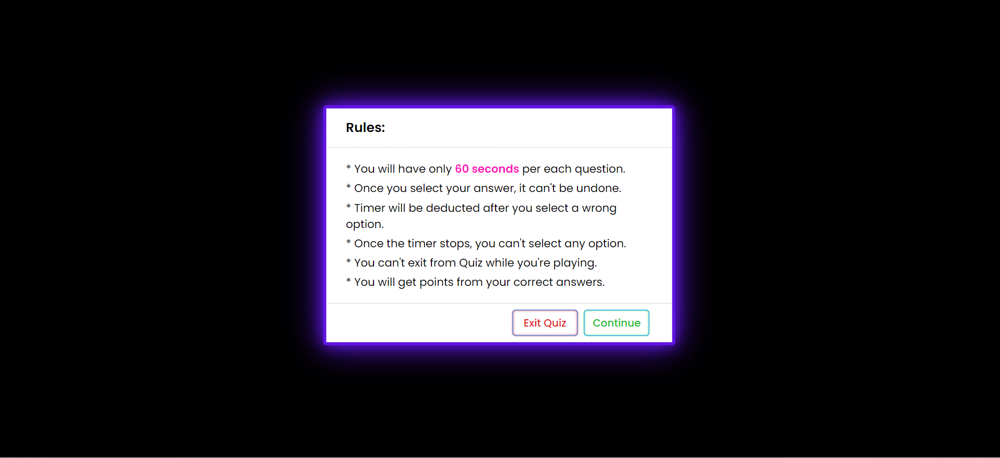

# 04 JavaScript: Quiz creation

# 📖 Task requirements:

* On this task, I have to create an application that enables users to
generate random passwords based on the criteria that they've selected.
Working mostly with JavaScript to achieve that. 

## 💡What were the requirements that had to be met in order for this task to be completed ? 

* Linking the buttom to the questions. 

* Making sure that the browser checks for numbers instead of letters.

* Using optical messages to confirm the criteria questions, and veryfying 
that it's working as it should be.

* Using a loop to pick a random number from the characters.

## 📝 Link for the live-version of the project
 
https://joevictor.github.io/Code-Quiz/

